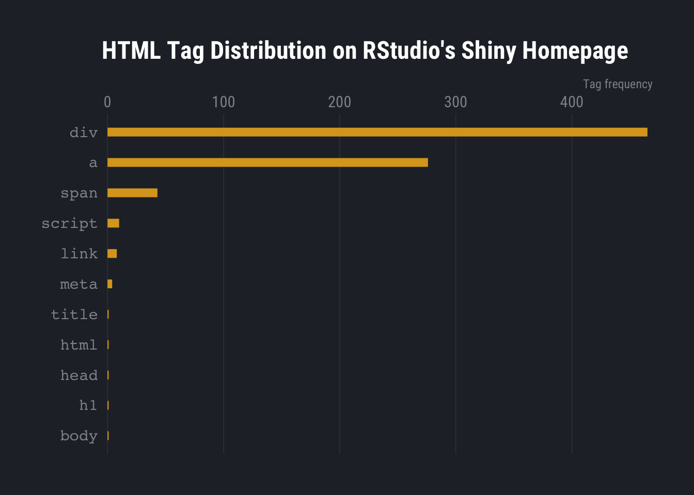

[](https://travis-ci.org/hrbrmstr/reapr)
[](https://codecov.io/gh/hrbrmstr/reapr)
[](https://cran.r-project.org/package=reapr)

# reapr

Reap Information from Websites

## Description

There’s no longer need to fear getting at the gnarly bits of web pages.
For the vast majority of web scraping tasks, the ‘rvest’ package does a
phenomenal job providing just enough of what you need to get by. But, if
you want more of the details of the site you’re scraping, some handy
shortcuts to page elements in use and the ability to not have to think
too hard about serialization during scraping tasks, then you may be
interested in reaping more than harvesting. Tools are provided to
interact with web sites content and metadata more granular level than
‘rvest’ but at a higher level than ‘httr’/‘curl’.

## NOTE

This is very much a WIP but there are enough basic features to let
others kick the tyres and see what’s woefully busted or in need of
attention.

## What’s Inside The Tin

The following functions are implemented:

  - `reap_url`: Read HTML content from a URL
  - `mill`: Turn a ‘reapr\_doc’ into plain text without cruft
  - `reapr`: Reap Information from Websites
  - `reap_attr`: Reap text, names and attributes from HTML
  - `reap_attrs`: Reap text, names and attributes from HTML
  - `reap_children`: Reap text, names and attributes from HTML
  - `reap_name`: Reap text, names and attributes from HTML
  - `reap_node`: Reap nodes from an reaped HTML document
  - `reap_nodes`: Reap nodes from an reaped HTML document
  - `reap_table`: Extract data from HTML tables
  - `reap_text`: Reap text, names and attributes from HTML
  - `add_response_url_from`: Add a ‘reapr\_doc’ response prefix URL to a
    data frame

## Installation

``` r
devtools::install_git("https://git.sr.ht/~hrbrmstr/reapr")
# or 
devtools::install_git("https://gitlab.com/hrbrmstr/reapr.git")
# or
devtools::install_github("hrbrmstr/reapr")
```

## Usage

``` r
library(reapr)
library(hrbrthemes) # sr.hr/~hrbrmstr/hrbrthemes | git[la|hu]b.com/hrbrmstr/hrbrthemes
library(tidyverse) # for some examples only

# current version
packageVersion("reapr")
## [1] '0.1.0'
```

## Basic Reaping

``` r
x <- reap_url("http://rud.is/b")

x
##                Title: rud.is | "In God we trust. All others must bring data"
##         Original URL: http://rud.is/b
##            Final URL: https://rud.is/b/
##           Crawl-Date: 2019-01-17 19:51:09
##               Status: 200
##         Content-Type: text/html; charset=UTF-8
##                 Size: 50 kB
##           IP Address: 104.236.112.222
##                 Tags: body[1], center[1], form[1], h2[1], head[1], hgroup[1], html[1],
##                       label[1], noscript[1], section[1], title[1],
##                       aside[2], nav[2], ul[2], style[5], img[6],
##                       input[6], article[8], time[8], footer[9], h1[9],
##                       header[9], p[10], li[19], meta[20], div[31],
##                       script[40], span[49], link[53], a[94]
##           # Comments: 17
##   Total Request Time: 2.093s
```

The formatted object print-output shows much of what you get with a
reaped URL.

`reapr::real_url()`:

  - Uses `httr::GET()` to make web connections and retrieve content.
    This enables it to behave more like an actual
    (non-javascript-enabled) browser. You can pass anything
    `httr::GET()` can handle to `...` (e.g. `httr::user_agent()`) to
    have as much granular control over the interaction as possible.
  - Returns a richer set of data. After the `httr::response` object is
    obtained many tasks are performed including:
      - timestamping the URL crawl
      - extraction of the asked-for URL and the final URL (in the case
        of redirects)
      - extraction of the IP address of the target server
      - extraction of both plaintext and parsed (`xml_document`) HTML
      - extraction of the plaintext webpage `<title>` (if any)
      - generation of a dynamic list tags in the document which can be
        fed directly to HTML/XML search/retrieval function (which may
        speed up node discovery)
      - extraction of the text of all comments in the HTML document
      - inclusion of the full `httr::response` object with the returned
        object
      - extraction of the time it took to make the complete request

Finally, it works with other package member functions to check the
validity of the parsed `xml_document` and auto-regen the parse (since it
has the full content available to it) prior to any other operations.
This also makes `reapr_doc` object *serializable* without having to
spend your own cycles on that.

If you need more or need the above in different ways please file issues.

## Pre-computed Tags

On document retrieval, `reapr` automagically builds convenient
R-accessible lists of all the tags in the retrieved document. They
aren’t recursive, but they are a convenient “bags” of tags to use when
you don’t feel like crafting that perfect XPath.

Let’s see what tags RStudio favors most on their Shiny home page:

``` r
x <- reap_url("https://shiny.rstudio.com/articles/")

x
##                Title: Shiny - Articles
##         Original URL: https://shiny.rstudio.com/articles/
##            Final URL: https://shiny.rstudio.com/articles/
##           Crawl-Date: 2019-01-17 19:51:10
##               Status: 200
##         Content-Type: text/html
##                 Size: 79 kB
##           IP Address: 13.35.78.118
##                 Tags: body[1], h1[1], head[1], html[1], title[1], meta[4], link[8],
##                       script[10], span[43], a[276], div[465]
##           # Comments: 25
##   Total Request Time: 0.191s

enframe(sort(lengths(x$tag))) %>%
  mutate(name = factor(name, levels = name)) %>%
  ggplot(aes(value, name)) +
  geom_segment(aes(xend = 0, yend = name), , size = 3, color = "goldenrod") +
  labs(
    x = "Tag frequency", y = NULL,
    title = "HTML Tag Distribution on RStudio's Shiny Homepage"
  ) +
  scale_x_comma(position = "top") +
  theme_ft_rc(grid = "X") +
  theme(axis.text.y = element_text(family = "mono"))
```



Lots and lots of `<div>`s\!

``` r
x$tag$div
## {xml_nodeset (465)}
##  [1] <div id="app" class="shrinkHeader alwaysShrinkHeader">\n  <div id="main">\n    <!-- rstudio header -->\n    <div ...
##  [2] <div id="main">\n    <!-- rstudio header -->\n    <div id="rStudioHeader">\n      <div class="band">\n        <d ...
##  [3] <div id="rStudioHeader">\n      <div class="band">\n        <div class="innards bandContent">\n          <div>\n ...
##  [4] <div class="band">\n        <div class="innards bandContent">\n          <div>\n            <a class="productNam ...
##  [5] <div class="innards bandContent">\n          <div>\n            <a class="productName" href="/">Shiny</a>\n      ...
##  [6] <div>\n            <a class="productName" href="/">Shiny</a>\n            <div class="rStudio">\n<span>from </sp ...
##  [7] <div class="rStudio">\n<span>from </span> <a href="https://www.rstudio.com/"><div class="rStudioLogo"></div></a> ...
##  [8] <div class="rStudioLogo"></div>
##  [9] <div id="menu">\n            <div id="menuToggler"></div>\n            <div id="menuItems" class="">\n           ...
## [10] <div id="menuToggler"></div>
## [11] <div id="menuItems" class="">\n              <a class="menuItem" href="/tutorial/">Get Started</a>\n             ...
## [12] <div class="mainContent pushFooter">\n\n  <div class="band">\n    <a name="top"></a>\n    <div class="bandConten ...
## [13] <div class="band">\n    <a name="top"></a>\n    <div class="bandContent">\n      <h1>Articles</h1>\n    </div>\n ...
## [14] <div class="bandContent">\n      <h1>Articles</h1>\n    </div>
## [15] <div class="band articlesBand">\n    <div class="bandContent">\n      <div class="articles-outline splitColumns  ...
## [16] <div class="bandContent">\n      <div class="articles-outline splitColumns withMobileMargins">\n\n        \n     ...
## [17] <div class="articles-outline splitColumns withMobileMargins">\n\n        \n          <div class="column25 start" ...
## [18] <div class="column25 start">\n            <div class="section-title">Start</div>\n            \n              <d ...
## [19] <div class="section-title">Start</div>
## [20] <div class="subsection-group">\n                <div class="subsection-group-title"></div>\n                \n   ...
## ...
```

Let’s take a look at the article titles:

``` r
as.data.frame(x$tag$div) %>% 
  filter(class == "article-title") %>% 
  select(`Shiny Articles`=elem_content) %>% 
  knitr::kable()
```

| Shiny Articles                                                                      |
| :---------------------------------------------------------------------------------- |
| The basic parts of a Shiny app                                                      |
| How to build a Shiny app                                                            |
| How to launch a Shiny app                                                           |
| How to get help                                                                     |
| The Shiny Cheat sheet                                                               |
| App formats and launching apps                                                      |
| Two-file Shiny apps                                                                 |
| Introduction to R Markdown                                                          |
| Introduction to interactive documents                                               |
| R Markdown integration in the RStudio IDE                                           |
| The R Markdown Cheat sheet                                                          |
| Setting Output args via Render functions                                            |
| Generating downloadable reports                                                     |
| Dashboards                                                                          |
| Shiny Gadgets                                                                       |
| Designing Gadget UI                                                                 |
| Reactivity - An overview                                                            |
| Stop reactions with isolate()                                                       |
| Execution scheduling                                                                |
| How to understand reactivity in R                                                   |
| Learn about your user with session$clientData                                       |
| Database basics - dplyr and DBI                                                     |
| SQL injection prevention                                                            |
| Using the pool package (basics)                                                     |
| Using the pool package (advanced)                                                   |
| Using dplyr and pool to query a database                                            |
| Persistent data storage in Shiny apps                                               |
| Application layout guide                                                            |
| Display modes                                                                       |
| Tabsets                                                                             |
| Customize your UI with HTML                                                         |
| Build your entire UI with HTML                                                      |
| Build a dynamic UI that reacts to user input                                        |
| HTML Templates                                                                      |
| Shiny HTML Tags Glossary                                                            |
| Progress indicators                                                                 |
| Modal dialogs                                                                       |
| Notifications                                                                       |
| Themes                                                                              |
| Render images in a Shiny app                                                        |
| Displaying and customizing static tables                                            |
| How to use DataTables in a Shiny App                                                |
| Using Action Buttons                                                                |
| Using sliders                                                                       |
| Help users download data from your app                                              |
| Help users upload files to your app                                                 |
| Using selectize input                                                               |
| Interactive plots                                                                   |
| Selecting rows of data                                                              |
| Interactive plots - advanced                                                        |
| htmlwidgets                                                                         |
| JavaScript actions packaged for Shiny apps                                          |
| How to build a JavaScript based widget                                              |
| How to add functionality to JavaScript widgets                                      |
| How to send messages from the browser to the server and back using Shiny            |
| How to develop an interactive, dynamic help system for your app with introJS        |
| How to create custom input bindings                                                 |
| Putting everything together to create an interactive dashboard                      |
| Style your apps with CSS                                                            |
| Build custom input objects                                                          |
| Build custom output objects                                                         |
| Add Google Analytics to a Shiny app                                                 |
| Packaging JavaScript code for Shiny                                                 |
| Communicating with Shiny via JavaScript                                             |
| JavaScript Events in Shiny                                                          |
| Debugging Shiny applications                                                        |
| Upgrading to a new version of R                                                     |
| Handling missing inputs with req(…)                                                 |
| Scoping rules for Shiny apps                                                        |
| Reconnecting to Shiny apps                                                          |
| Sanitizing error messages                                                           |
| Write error messages for your UI with validate                                      |
| Unicode characters in Shiny apps                                                    |
| shinytest                                                                           |
| Modularizing Shiny app code                                                         |
| Shiny App Usage Tracking                                                            |
| Add Google Analytics to a Shiny app                                                 |
| Plot Caching                                                                        |
| Profiling your Shiny app                                                            |
| Performance                                                                         |
| Improving scalability with async programming                                        |
| Scaling and Performance Tuning with shinyapps.io                                    |
| Scaling and Performance Tuning with Shiny Server Pro and RStudio Connect            |
| Deploying Shiny apps to the web                                                     |
| Shinyapps.io - Getting started                                                      |
| Shinyapps.io - Authentication and Authorization Model                               |
| Shinyapps.io - Setting up custom domains                                            |
| Shinyapps.io - Sharing data across sessions                                         |
| Shinyapps.io - Migrating authentication                                             |
| Shiny Server - Introduction                                                         |
| Shiny Server and Shiny Server Pro - Allowing different libraries for different apps |
| Shiny Server Pro and RStudio Connect - Creating user privileges                     |
| Shiny Server Pro and RStudio Connect - Administrating deployed Shiny applications   |
| Sharing apps to run locally                                                         |
| Save your app as a function                                                         |
| Bookmarking state                                                                   |
| Advanced bookmarking                                                                |
| Bookmarking and modules                                                             |

No XPath or CSS selectors\!

Let’s abandon the `tidyverse` for base R piping for a minute and do
something similar to extract and convert the index of [CRAN Task
Views](https://cloud.r-project.org/web/views/) to a markdown list (which
will conveniently render here). Again, no XPath or CSS selectors
required once we read in the URL:

``` r
x <- reap_url("https://cloud.r-project.org/web/views/")

as.data.frame(x$tag$a) %>% 
  add_response_url_from(x) %>% 
  subset(!grepl("^http[s]://", href)) %>% 
  transform(href = sprintf("- [%s](%s%s)", elem_content, prefix_url, href)) %>% 
  .[, "href", drop=TRUE] %>% 
  paste0(collapse = "\n") %>% 
  cat()
```

  - [Bayesian](https://cloud.r-project.org/web/views/Bayesian.html)
  - [ChemPhys](https://cloud.r-project.org/web/views/ChemPhys.html)
  - [ClinicalTrials](https://cloud.r-project.org/web/views/ClinicalTrials.html)
  - [Cluster](https://cloud.r-project.org/web/views/Cluster.html)
  - [Databases](https://cloud.r-project.org/web/views/Databases.html)
  - [DifferentialEquations](https://cloud.r-project.org/web/views/DifferentialEquations.html)
  - [Distributions](https://cloud.r-project.org/web/views/Distributions.html)
  - [Econometrics](https://cloud.r-project.org/web/views/Econometrics.html)
  - [Environmetrics](https://cloud.r-project.org/web/views/Environmetrics.html)
  - [ExperimentalDesign](https://cloud.r-project.org/web/views/ExperimentalDesign.html)
  - [ExtremeValue](https://cloud.r-project.org/web/views/ExtremeValue.html)
  - [Finance](https://cloud.r-project.org/web/views/Finance.html)
  - [FunctionalData](https://cloud.r-project.org/web/views/FunctionalData.html)
  - [Genetics](https://cloud.r-project.org/web/views/Genetics.html)
  - [Graphics](https://cloud.r-project.org/web/views/Graphics.html)
  - [HighPerformanceComputing](https://cloud.r-project.org/web/views/HighPerformanceComputing.html)
  - [Hydrology](https://cloud.r-project.org/web/views/Hydrology.html)
  - [MachineLearning](https://cloud.r-project.org/web/views/MachineLearning.html)
  - [MedicalImaging](https://cloud.r-project.org/web/views/MedicalImaging.html)
  - [MetaAnalysis](https://cloud.r-project.org/web/views/MetaAnalysis.html)
  - [MissingData](https://cloud.r-project.org/web/views/MissingData.html)
  - [ModelDeployment](https://cloud.r-project.org/web/views/ModelDeployment.html)
  - [Multivariate](https://cloud.r-project.org/web/views/Multivariate.html)
  - [NaturalLanguageProcessing](https://cloud.r-project.org/web/views/NaturalLanguageProcessing.html)
  - [NumericalMathematics](https://cloud.r-project.org/web/views/NumericalMathematics.html)
  - [OfficialStatistics](https://cloud.r-project.org/web/views/OfficialStatistics.html)
  - [Optimization](https://cloud.r-project.org/web/views/Optimization.html)
  - [Pharmacokinetics](https://cloud.r-project.org/web/views/Pharmacokinetics.html)
  - [Phylogenetics](https://cloud.r-project.org/web/views/Phylogenetics.html)
  - [Psychometrics](https://cloud.r-project.org/web/views/Psychometrics.html)
  - [ReproducibleResearch](https://cloud.r-project.org/web/views/ReproducibleResearch.html)
  - [Robust](https://cloud.r-project.org/web/views/Robust.html)
  - [SocialSciences](https://cloud.r-project.org/web/views/SocialSciences.html)
  - [Spatial](https://cloud.r-project.org/web/views/Spatial.html)
  - [SpatioTemporal](https://cloud.r-project.org/web/views/SpatioTemporal.html)
  - [Survival](https://cloud.r-project.org/web/views/Survival.html)
  - [TimeSeries](https://cloud.r-project.org/web/views/TimeSeries.html)
  - [WebTechnologies](https://cloud.r-project.org/web/views/WebTechnologies.html)
  - [gR](https://cloud.r-project.org/web/views/gR.html)

This functionality is not a panacea since they are just bags of tags,
but it may save you some time and frustration.

## Tables

Unlike `rvest` with it’s magical and wonderful `html_table()` `reapr`
provides more raw control over the content of `<table>` elements. Let’s
look at the “population change over time” table from the Wikipedia page
on the demography of the UK
(<https://en.wikipedia.org/wiki/Demography_of_the_United_Kingdom>):

``` r
x <- reap_url("https://en.wikipedia.org/wiki/Demography_of_the_United_Kingdom")

reap_node(x, ".//table[contains(., 'Intercensal')]") %>% 
  reap_table()
## # A tibble: 18 x 8
##    V1         V2             V3             V4            V5            V6            V7            V8                  
##    <chr>      <chr>          <chr>          <chr>         <chr>         <chr>         <chr>         <chr>               
##  1 Intercens… Populationat … Average annua… Average annu… Average annu… Average annu… Average annu… Populationdensityat…
##  2 Intercens… Populationat … Overallchange  Births        Deaths        Net naturalc… Netmigration* Populationdensityat…
##  3 1851–1861  27,368,800     154,910        Unknown       Unknown       Unknown       Unknown       87                  
##  4 1861–1871  28,917,900     256,680        Unknown       Unknown       Unknown       Unknown       92                  
##  5 1871–1881  31,484,700     344,980        Unknown       Unknown       Unknown       Unknown       100                 
##  6 1881–1891  34,934,500     286,790        Unknown       Unknown       Unknown       Unknown       111                 
##  7 1891–1901  37,802,400     373,580        Unknown       Unknown       Unknown       Unknown       120                 
##  8 1901–1911  38,237,000     385,000        1,091,000     624,000       467,000       −82,000       156                 
##  9 1911–1921  42,082,000     195,000        975,000       689,000       286,000       −92,000       172                 
## 10 1921–1931  44,027,000     201,000        824,000       555,000       268,000       −67,000       180                 
## 11 1931–1951  46,038,000     213,000        793,000       603,000       190,000       22,000        188                 
## 12 1951–1961  50,225,000     258,000        839,000       593,000       246,000       12,000        205                 
## 13 1961–1971  52,807,000     312,000        962,000       638,000       324,000       −12,000       216                 
## 14 1971–1981  55,928,000     42,000         736,000       666,000       69,000        −27,000       229                 
## 15 1981–1991  56,357,000     108,000        757,000       655,000       103,000       5,000         231                 
## 16 1991–2001  57,439,000     161,000        731,000       631,000       100,000       61,000        235                 
## 17 2001–2011  59,113,000     324,000        722,000       588,000       134,000       191,000       242                 
## 18 2011–2021  63,182,000     N/A            N/A           N/A           N/A           N/A           259
```

As you can see, it doesn’t do the cleanup work for you and has no way to
even say there’s a header. That’s because you can do that with
`rvest::html_table()`. The equivalent `reapr` function gives you the raw
table and handles `colspan` and `rowspan` insanity by adding the missing
cells and filling in the gaps. You can use
`docxtractr::assign_colnames()` to make a given row the column titles
and `docxtractr::mcga()` or `janitor::clean_names()` to name them proper
R names then `readr::type_convert()` to finish the task.

While that may seem overkill for this example (it is), it wouldn’t be if
the table were more gnarly (I’m working on an example for that which
will replace this one when it’s done).

For truly gnarly tables you can get an overview of the structure
(without the data frame conversion):

``` r
reap_node(x, ".//table[contains(., 'Intercensal')]") %>% 
  reap_table(raw = TRUE) -> raw_tbl

raw_tbl
## <table class='wikitable...'>
##   <row (noattrs)>
##     <cell rowspan='2'>
##     <cell rowspan='2'>
##     <cell colspan='5'>
##     <cell rowspan='2'>
##   <row (noattrs)>
##     <cell (noattrs)>
##     <cell (noattrs)>
##     <cell (noattrs)>
##     <cell (noattrs)>
##     <cell (noattrs)>
##   <row (noattrs)>
##     <cell (noattrs)>
##     <cell (noattrs)>
##     <cell (noattrs)>
##     <cell style='backgroun...' class='unknown t...'>
##     <cell style='backgroun...' class='unknown t...'>
##     <cell style='backgroun...' class='unknown t...'>
##     <cell style='backgroun...' class='unknown t...'>
##     <cell (noattrs)>
##   <row (noattrs)>
##     <cell (noattrs)>
##     <cell (noattrs)>
##     <cell (noattrs)>
##     <cell style='backgroun...' class='unknown t...'>
##     <cell style='backgroun...' class='unknown t...'>
##     <cell style='backgroun...' class='unknown t...'>
##     <cell style='backgroun...' class='unknown t...'>
##     <cell (noattrs)>
##   <row (noattrs)>
##     <cell (noattrs)>
##     <cell (noattrs)>
##     <cell (noattrs)>
##     <cell style='backgroun...' class='unknown t...'>
##     <cell style='backgroun...' class='unknown t...'>
##     <cell style='backgroun...' class='unknown t...'>
##     <cell style='backgroun...' class='unknown t...'>
##     <cell (noattrs)>
##   <row (noattrs)>
##     <cell (noattrs)>
##     <cell (noattrs)>
##     <cell (noattrs)>
##     <cell style='backgroun...' class='unknown t...'>
##     <cell style='backgroun...' class='unknown t...'>
##     <cell style='backgroun...' class='unknown t...'>
##     <cell style='backgroun...' class='unknown t...'>
##     <cell (noattrs)>
##   <row (noattrs)>
##     <cell (noattrs)>
##     <cell (noattrs)>
##     <cell (noattrs)>
##     <cell style='backgroun...' class='unknown t...'>
##     <cell style='backgroun...' class='unknown t...'>
##     <cell style='backgroun...' class='unknown t...'>
##     <cell style='backgroun...' class='unknown t...'>
##     <cell (noattrs)>
##   <row (noattrs)>
##     <cell (noattrs)>
##     <cell (noattrs)>
##     <cell (noattrs)>
##     <cell (noattrs)>
##     <cell (noattrs)>
##     <cell (noattrs)>
##     <cell (noattrs)>
##     <cell (noattrs)>
##   <row (noattrs)>
##     <cell (noattrs)>
##     <cell (noattrs)>
##     <cell (noattrs)>
##     <cell (noattrs)>
##     <cell (noattrs)>
##     <cell (noattrs)>
##     <cell (noattrs)>
##     <cell (noattrs)>
##   <row (noattrs)>
##     <cell (noattrs)>
##     <cell (noattrs)>
##     <cell (noattrs)>
##     <cell (noattrs)>
##     <cell (noattrs)>
##     <cell (noattrs)>
##     <cell (noattrs)>
##     <cell (noattrs)>
##   <row (noattrs)>
##     <cell (noattrs)>
##     <cell (noattrs)>
##     <cell (noattrs)>
##     <cell (noattrs)>
##     <cell (noattrs)>
##     <cell (noattrs)>
##     <cell (noattrs)>
##     <cell (noattrs)>
##   <row (noattrs)>
##     <cell (noattrs)>
##     <cell (noattrs)>
##     <cell (noattrs)>
##     <cell (noattrs)>
##     <cell (noattrs)>
##     <cell (noattrs)>
##     <cell (noattrs)>
##     <cell (noattrs)>
##   <row (noattrs)>
##     <cell (noattrs)>
##     <cell (noattrs)>
##     <cell (noattrs)>
##     <cell (noattrs)>
##     <cell (noattrs)>
##     <cell (noattrs)>
##     <cell (noattrs)>
##     <cell (noattrs)>
##   <row (noattrs)>
##     <cell (noattrs)>
##     <cell (noattrs)>
##     <cell (noattrs)>
##     <cell (noattrs)>
##     <cell (noattrs)>
##     <cell (noattrs)>
##     <cell (noattrs)>
##     <cell (noattrs)>
##   <row (noattrs)>
##     <cell (noattrs)>
##     <cell (noattrs)>
##     <cell (noattrs)>
##     <cell (noattrs)>
##     <cell (noattrs)>
##     <cell (noattrs)>
##     <cell (noattrs)>
##     <cell (noattrs)>
##   <row (noattrs)>
##     <cell (noattrs)>
##     <cell (noattrs)>
##     <cell (noattrs)>
##     <cell (noattrs)>
##     <cell (noattrs)>
##     <cell (noattrs)>
##     <cell (noattrs)>
##     <cell (noattrs)>
##   <row (noattrs)>
##     <cell (noattrs)>
##     <cell (noattrs)>
##     <cell (noattrs)>
##     <cell (noattrs)>
##     <cell (noattrs)>
##     <cell (noattrs)>
##     <cell (noattrs)>
##     <cell (noattrs)>
##   <row (noattrs)>
##     <cell (noattrs)>
##     <cell (noattrs)>
##     <cell data-sort-value='' style='backgroun...' class='table-na'>
##     <cell data-sort-value='' style='backgroun...' class='table-na'>
##     <cell data-sort-value='' style='backgroun...' class='table-na'>
##     <cell data-sort-value='' style='backgroun...' class='table-na'>
##     <cell data-sort-value='' style='backgroun...' class='table-na'>
##     <cell (noattrs)>
```

And work with the `list` it gives back (which contains all the HTML
element attributes as R attributes so you can pull data stored in them
if need
be).

## reapr Metrics

| Lang | \# Files |  (%) | LoC |  (%) | Blank lines |  (%) | \# Lines |  (%) |
| :--- | -------: | ---: | --: | ---: | ----------: | ---: | -------: | ---: |
| R    |       13 | 0.81 | 405 | 0.87 |         148 | 0.72 |      251 | 0.69 |
| Rmd  |        1 | 0.06 |  44 | 0.09 |          53 | 0.26 |      110 | 0.30 |
| C    |        2 | 0.12 |  17 | 0.04 |           5 | 0.02 |        4 | 0.01 |

## Code of Conduct

Please note that this project is released with a [Contributor Code of
Conduct](CONDUCT.md). By participating in this project you agree to
abide by its terms.
